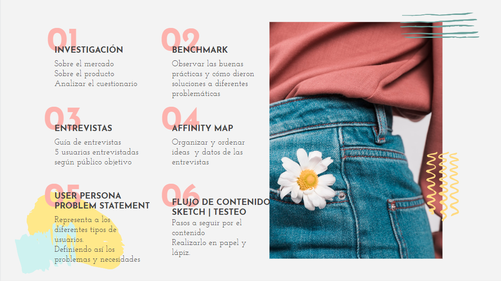

# **STYLE PASS**

_"Style Pass_, primera plataforma on-line de alquiler de ropa del Perú, con el propósito que las mujeres puedan disfrutar de la moda en su día a día de manera económica y sostenible, teniendo como aliados a diseñadores y marcas de ropa locales.

## Índice
___
- [Objetivos del Proyecto](#objetivos-del-proyecto)
- [Implementación](#implementación)
- [Nuestro proceso de rediseño UX](#Nuestro-proceso-de-rediseño-UX)
    - [1. Descubrimiento e investigación](#1.Descubrimiento-e-investigación)
        - [Entrevista con el Cliente](#Entrevista-con-el-cliente)
        - [Entrevista con el Usuario](#Entrevista-con-el-Usuario)
        - [Benchmark](#Benchmark)

     - [2. Síntesis y Definición](#2.Síntesis-y-Definición)
        - [Affinity Map](#affinity-map)
        - [User Persona](#user-persona)
        - [Definición del Producto](#definicion-del-producto)

     - [3. Ideación del producto](#3.Ideación-del-producto)
        - [Sketch](#Sketch)

    - [4.Prototipado y Testing](#4.Prototipado-y-Testing)

- [Enlaces](#enlaces)

## Objetivos del Proyecto
---
* Ser la primera plataforma on-line de alquiler de ropa del Perú.
* Introducir una nueva forma de consumir.

## Implementación
---
 Para realizar este proyecto hemos seleccionado las siguientes actividades para poder crear nuestra propuesta de valor:

|Actividad|Descripción|Puntos|
|:----|:---|:---:|
|Entendimiento del problema|Entender a fondo el problema tras haber analizado el contexto.|15|
|Entrevista con cliente|Realización de entrevistas con el cliente y establecimiento de sus metas y objetivos.| 25 |
|Benchmark| Referencias indirectas. | 20 |
|Entrevistas con usuarios| Entrevistas con al menos 5 usuarios. | 60 | 
|Sketching | Elaboración de prototipo de baja fidelidad. | 30 |
|Prototipado de alta fidelidad| Diseño en base a las conclusiones obtenidas | 80 |
|Testeos de prototipos| Sesiones de testing de la solución propuesta (baja y alta fidelidad) con al menos 5 usuarios por sesión. | 60 |
|| Total | 290  |

## Nuestro proceso de diseño UX
---
Todas las actividades y productos generados en esta investigación estuvo enmarcado en el Diseño centrado en el usuario y se pueden dividir en las siguientes etapas del proceso Design Thinking.

### 1.Descubrimiento e investigación
En esta fase aplicamos las siguientes herramientas que nos ayudaron a entender el contexto, el usuario, al cliente y a la empresa.
#### Entrevista con el Cliente:
La entrevista fue realizada el 05 de Setiembre a las 16:30 horas  a Michael Gonzales Neyra, Product owner del BCP.   
   * ***[Audio](https://drive.google.com/drive/folders/1Fi9K2--BG1EbGJmbsPXmLNfzKb_rTLzH)***

Se obtuvo como conclusiones más resaltantes:
* Style Pass es un plan de negocion innovador en Peru.
* Los objetivos como negocio son:
  * Introducir una nueva forma de consumir.
  *Ser la primera plataforma online de alquiler de ropa, a través de un plan mensual.
  *Crear confianza en el cliente.
  *Ser una plataforma que permita encontrar la prendas ideales de acuerdo al perfil de cada uno. (Fácil navegación, prendas agrupadas por talla y categoría).
* Como principios el negocio tiene:
  * Satisfacción del cliente
  * Personalizado, que se adapte a cada persona.

#### Entrevista con el usuario
Se llevó a cabo con 5 usuarios. Sus edades promedian entre los 25 y 28 años.

* ***[Guia de entrevista](https://docs.google.com/document/d/18PFt2qjIZSSPfcnxk-PgpROGTgMJqMZJjrwnt_5yeV0/edit)***

* ***[Audio](https://drive.google.com/drive/u/1/folders/1-7h7O9MqJKNXCCPMgkCMkYTZK3cy0QBP)***
 
Conclusiones más relevantes:
* Los usuarios no suelen alquilar cualquier ropa, pero si es exclusiva podrian hacer la excepción.
* Prestigio de la marca.
* Les importa mucho las medidas exactas de las prendas.
* La aplicación bancaria  que más suelen usar es la del bcp.
* Les gusta alquilar para ocasiones especiales.

#### Benchmark
Para tener un panorama más claro y certero de las  decidimos realizar un Benchmarking de las plataformas líderes en el extranjero.

### 2.Síntesis y definición
Esta etapa nos permitió aterrizar hallazgos en una propuesta de valor. 
#### Affinity Map
Con los resultados de las entrevistas a 5 usuarios, realizamos un Afinity map para organizar y sintetizar lo que encontramos y así analizar las preferencias o gustos en común que tienen.
Ordenamos por categorías las respuestas de las entrevistas para sintetizar y analizarlas. 

Gracias al diagrama de afinidad, logramos enfocarnos en 3 categorías más nombradas: Alquiler de prenda, valoración, contenido de la página web.

#### User Persona
Con toda la información proporcionada en la investigación, diseñamos el siguiente user presona.

#### Problem statements y how might we

#### Definicion del producto
Diseño de MVP

### 3.Ideación del producto
#### Sketch
Iniciamos realizando un prototipo de baja fidelidad en donde plasmamos diversas ideas centrado en el usuario, de acuerdo a las entrevistas a usuarios.

### 4.Prototipado y Testing

#### Prototipado en alta fidelidad
Nuestro prototipo de alta fidelidad muestra las interacciones que serán parte del producto final y corresponde a las funcionalidades que solucionan los 5 problem statements que hemos priorizado. 
* ***[Prototipo de alta fidelidad en Figma](https://www.figma.com/file/dz2UOGigCj682iG3BcSSAU/STYLE-PASS-version-Les?node-id=389%3A52941)***
* ***[Prototipo interactivo en Invision](https://projects.invisionapp.com/share/TMUCS81WAKC#/screens)***
#### Testing
Hicimos testing con 5 usuarios entre 25 y 30 años. Y sacamos dos conclusiones principales:
* Mejorar la forma en como se muestra el plan mensual.
* Mejorar el acceso al registro y modelo de lista de espera.

## Enlaces
* Conoce a detalle el proceso de trabajo de este diseño
Acceso a la documentación ---> ***[Ir al drive](https://drive.google.com/drive/u/1/folders/1QP8NPJlyjbyNn_zgkGM5HnZu6w_MF1-y)***

